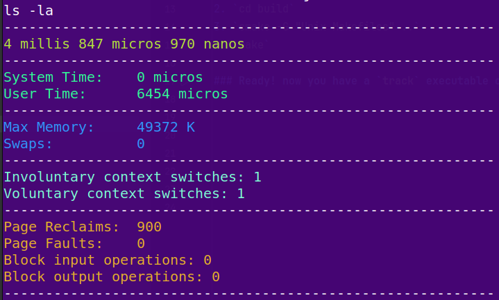

# Track

## CLI utility to find resources usage information and running time about a program ou command

### 1. Only for linux for now.
### 2. Depends on fmt. So: `sudo apt install libfmt-dev`

## install

1. `mkdir build`
2. `cd build`
3. `cmake -G "Unix Makefiles" ..`
4. `make`

### Ready! now you have a `track` executable on the root folder of the project. Put it on your path.

##

